<div align="center">

# Analysis of Barren Plateaus in Machine Learning Training

## Анализ «бесплодных плато» при проведении анализа обучения моделей машинного обучения (Barren Plateaus)

</div>

---

## О проекте

Проект исследует эффект **barren plateau** («бесплодного плато») при обучении вариационных квантовых классификаторов. Основная цель — понять, почему при увеличении числа кубитов квантовая модель может не улучшаться, а наоборот терять обучаемость из-за исчезающих градиентов.

В работе сравниваются:

* **VQC** — чистый вариационный квантовый классификатор;
* **VQC_hybrid** — гибридная квантово-классическая модель;
* **MLP** — классическая полносвязная нейросеть;
* дополнительные варианты Ansatz: `RY + CZ`, `BasicEntanglerLayers`, `StronglyEntanglingLayers`;
* адаптивная стратегия пересборки квантовой схемы.

Эксперимент проводится на двух синтетических датасетах: `Circles` и `Moons`. Для каждой конфигурации анализируются не только итоговые метрики качества, но и характеристики обучения: **loss**, **gradient norm**, **gradient variance** и **gradient mean**.

Главная исследовательская идея: **увеличение числа кубитов само по себе не гарантирует улучшения модели**. При слишком сложной или неудачно выбранной квантовой схеме рост числа кубитов может ослаблять градиентный сигнал и приводить к деградации обучения.

---

## Что такое Barren Plateau

**Barren plateau** — это эффект, при котором ландшафт функции потерь вариационной квантовой модели становится почти плоским. В результате градиенты параметров квантовой схемы стремятся к нулю, и оптимизатор перестает получать полезное направление для обновления весов.

Формально это можно записать через математическое ожидание градиента:

$$
\mathbb{E}_{\theta}\left[\frac{\partial C(\theta)}{\partial \theta_i}\right] \approx 0
$$

где:

* $C(\theta)$ — функция стоимости;
* $\theta$ — вектор обучаемых параметров квантовой схемы;
* $\theta_i$ — отдельный параметр схемы;
* $\frac{\partial C(\theta)}{\partial \theta_i}$ — градиент функции стоимости по параметру $\theta_i$;
* $\mathbb{E}_{\theta}$ — усреднение по случайным инициализациям параметров.

Ключевой диагностический признак barren plateau — затухание дисперсии градиента:

$$
\mathrm{Var}\left[\frac{\partial C(\theta)}{\partial \theta_i}\right] \to 0
$$

При росте числа кубитов это затухание может быть экспоненциальным:

$$
\mathrm{Var}\left[\frac{\partial C(\theta)}{\partial \theta_i}\right] \sim \mathcal{O}\left(\frac{1}{2^n}\right)
$$

где:

* $n$ — число кубитов;
* $C(\theta)$ — функция стоимости;
* $\theta_i$ — параметр квантовой схемы;
* $\mathcal{O}\left(\frac{1}{2^n}\right)$ — порядок убывания дисперсии при росте числа кубитов.

Если дисперсия градиентов становится близкой к нулю, разные параметры получают почти одинаково слабый обучающий сигнал. В таком случае даже адаптивные оптимизаторы вроде Adam не могут эффективно продолжать обучение.

---

## Цели

1. Измерить и сравнить градиентные характеристики VQC, VQC_hybrid и MLP.
2. Исследовать влияние числа кубитов на норму и дисперсию градиентов.
3. Проверить, защищает ли гибридная архитектура от barren plateau.
4. Сравнить разные варианты Ansatz по устойчивости обучения.
5. Построить графики loss, gradient norm и gradient variance по эпохам.
6. Предложить стратегию динамической пересборки квантовой схемы.
7. Разделить две причины плохого обучения: **нехватку выразительности** и **исчезновение градиентов**.

---

## Задачи

* Обучить `VQC`, `VQC_hybrid` и `MLP` на датасетах `Circles` и `Moons`.
* Посчитать **Gradient Norm**, **Gradient Variance**, **Gradient Mean** и `Loss_final`.
* Провести повторную диагностику VQC с логированием градиентов по эпохам.
* Сравнить Ansatz `RY + CZ`, `BasicEntanglerLayers` и `StronglyEntanglingLayers`.
* Построить графики деградации градиента при росте числа кубитов.
* Проверить адаптивную пересборку Ansatz как способ управления обучаемостью.
* Сформулировать выводы о связи архитектуры, числа кубитов и barren plateau.

---

## Датасеты

### Circles — кольцевая симметрия

Датасет `Circles` состоит из двух концентрических колец. Разделение классов задается радиальной структурой:

$$
x_1^2 + x_2^2 = r^2
$$

где:

* $x_1$, $x_2$ — координаты объекта;
* $r$ — радиус окружности, определяющий границу между классами.

Параметры: `n_samples = 5000`, `noise = 0.3`, `factor = 0.7`, `random_state = 42`.

Из-за шума классы частично перекрываются. Поэтому даже хорошо обученная модель не может достичь идеального качества: часть ошибок обусловлена структурой данных.

### Moons — плавная нелинейная граница

Датасет `Moons` состоит из двух нелинейно разделимых «полумесяцев». Параметры: `n_samples = 5000`, `noise = 0.3`, `random_state = 42`.

В отличие от `Circles`, эта задача имеет более высокую теоретическую разделимость, но требует гибкой нелинейной границы.

### Распределение данных

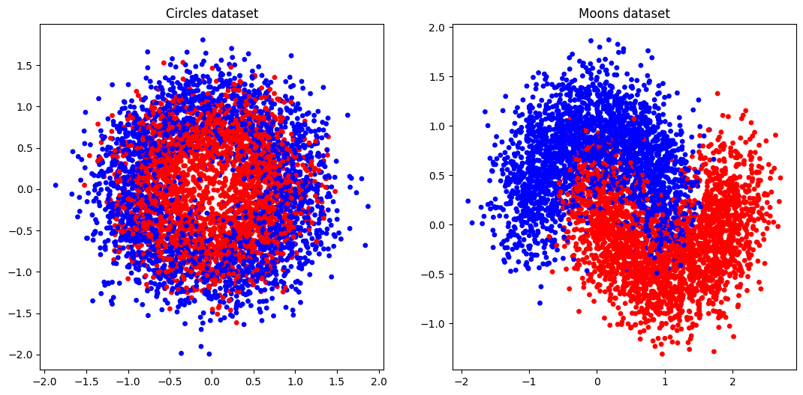

---

## Архитектуры моделей

### VQC

`VQC` — чистый вариационный квантовый классификатор без дополнительной классической части. Входные данные кодируются через `AngleEmbedding`:

$$
|\psi_0\rangle = \bigotimes_i R_Y(x_i)|0\rangle
$$

где:

* $|\psi_0\rangle$ — состояние после кодирования входных данных;
* $R_Y(x_i)$ — вращение кубита вокруг оси $Y$ на угол $x_i$;
* $x_i$ — $i$-й входной признак;
* $|0\rangle$ — начальное состояние кубита.

После кодирования применяется параметризованный Ansatz:

$$
|\psi(\theta, x)\rangle = U(\theta)E(x)|0\rangle^{\otimes n}
$$

где:

* $|\psi(\theta, x)\rangle$ — итоговое квантовое состояние;
* $E(x)$ — операция кодирования входных данных;
* $U(\theta)$ — параметризованная квантовая схема;
* $\theta$ — обучаемые параметры;
* $n$ — число кубитов.

В базовой модели используется `StronglyEntanglingLayers`, а измерение снимается с первого кубита через оператор Паули $Z$.

### VQC_hybrid

`VQC_hybrid` использует квантовую схему как **feature extractor**. В отличие от чистого VQC, измерения снимаются со всех кубитов:

$$
\varphi(x) = (\langle Z_0\rangle, \langle Z_1\rangle, \ldots, \langle Z_{n-1}\rangle) \in \mathbb{R}^{n}
$$

где:

* $\varphi(x)$ — вектор квантовых признаков;
* $\langle Z_i\rangle$ — ожидаемое значение оператора Паули $Z$ для кубита $i$;
* $n$ — число кубитов.

Затем этот вектор передается в классический слой `Linear(n_qubits → 1)`. Такая архитектура частично стабилизирует градиентный сигнал, потому что классический слой обучается обычным backpropagation.

### MLP

`MLP` — классическая полносвязная нейросеть на PyTorch. Она используется как базовая модель для сравнения, так как классические нейросети не сталкиваются с barren plateau в квантовом смысле.

В эксперименте тестируются конфигурации скрытых слоев:

* `[8, 8]`;
* `[16, 16]`;
* `[32, 32]`.

---

## Метрики

### Метрики классификации

**Accuracy:**

$$
\mathrm{Accuracy} = \frac{TP + TN}{TP + TN + FP + FN}
$$

где:

* $TP$ — true positive;
* $TN$ — true negative;
* $FP$ — false positive;
* $FN$ — false negative.

**F1-score:**

$$
F_1 = 2 \cdot \frac{\mathrm{Precision} \cdot \mathrm{Recall}}{\mathrm{Precision} + \mathrm{Recall}}
$$

где:

* $F_1$ — гармоническое среднее precision и recall;
* $\mathrm{Precision}$ — доля корректных положительных предсказаний среди всех положительных предсказаний;
* $\mathrm{Recall}$ — доля найденных положительных объектов среди всех объектов положительного класса.

### Метрики градиентов

**Gradient Norm:**

$$
\|\nabla C(\theta)\|_2 = \sqrt{\sum_{i=1}^{m}\left(\frac{\partial C(\theta)}{\partial \theta_i}\right)^2}
$$

где:

* $\|\nabla C(\theta)\|_2$ — евклидова норма градиента;
* $C(\theta)$ — функция стоимости;
* $\theta_i$ — отдельный обучаемый параметр;
* $m$ — число обучаемых параметров.

**Gradient Variance:**

$$
\mathrm{Var}(g) = \frac{1}{m}\sum_{i=1}^{m}(g_i - \bar{g})^2
$$

где:

* $g_i$ — значение градиента по параметру $\theta_i$;
* $\bar{g}$ — среднее значение градиентов;
* $m$ — число параметров.

**Средняя норма градиента на последних эпохах:**

$$
G_{\text{last}} = \frac{1}{K}\sum_{t=T-K+1}^{T}\|\nabla C_t(\theta)\|_2
$$

где:

* $G_{\text{last}}$ — средняя норма градиента на последних эпохах;
* $K$ — число последних эпох;
* $T$ — общее число эпох;
* $\nabla C_t(\theta)$ — градиент функции стоимости на эпохе $t$.

---

## Вычисление градиентов

Для каждой модели после обучения выполняется прямой и обратный проход. Далее собираются все параметрические градиенты, после чего вычисляются их норма и дисперсия.

```python
def compute_gradients(model, X, y, loss_fn=None):
    if loss_fn is None:
        loss_fn = torch.nn.BCELoss()

    X_t = torch.tensor(X, dtype=torch.float32)
    y_t = torch.tensor(y, dtype=torch.float32)

    model.zero_grad()
    preds = model(X_t).squeeze()
    loss = loss_fn(preds, y_t)
    loss.backward()

    grads = torch.cat([
        p.grad.detach().view(-1)
        for p in model.parameters()
        if p.grad is not None
    ])

    grad_norm = torch.norm(grads).item()
    grad_var = torch.var(grads).item()

    return grads.numpy(), grad_norm, grad_var
```

Для квантовых моделей PennyLane + PyTorch градиенты проходят через `TorchLayer`. Для классической MLP используется стандартное автодифференцирование PyTorch.

---

## Результаты базового эксперимента

Финальная таблица `df_results` содержит значения `Loss_final`, `Gradient_Norm`, `Gradient_Variance` и `Gradient_Mean` для базовых моделей.

| Model | Dataset | n_qubits | Hidden_Layers | Loss_final | Gradient_Norm | Gradient_Variance | Gradient_Mean |
|---|---|---:|---|---:|---:|---:|---:|
| VQC | Circles | 2 | — | 0.643854 | 0.000009 | 6.91e-12 | 7.01e-07 |
| VQC | Circles | 4 | — | 0.640622 | 0.000029 | 3.63e-11 | -5.86e-07 |
| VQC | Circles | 8 | — | 0.640622 | 0.000028 | 1.61e-11 | -7.49e-07 |
| VQC_hybrid | Circles | 2 | — | 0.581062 | 0.001358 | 8.22e-08 | 9.77e-05 |
| VQC_hybrid | Circles | 4 | — | 0.581043 | 0.004066 | 4.07e-07 | -8.21e-05 |
| VQC_hybrid | Circles | 8 | — | 0.581044 | 0.004162 | 2.13e-07 | -5.72e-05 |
| MLP | Circles | — | [8, 8] | 0.579721 | 0.002030 | 3.87e-08 | -3.05e-05 |
| MLP | Circles | — | [16, 16] | 0.576935 | 0.001610 | 7.66e-09 | 7.05e-06 |
| MLP | Circles | — | [32, 32] | 0.576921 | 0.024633 | 5.10e-07 | -4.98e-05 |
| VQC | Moons | 2 | — | 0.643854 | 0.000026 | 6.11e-11 | 1.50e-06 |
| VQC | Moons | 4 | — | 0.640622 | 0.000036 | 5.60e-11 | 1.28e-06 |
| VQC | Moons | 8 | — | 0.640620 | 0.000011 | 2.43e-12 | 3.36e-07 |
| VQC_hybrid | Moons | 2 | — | 0.581060 | 0.009810 | 4.81e-06 | 2.36e-05 |
| VQC_hybrid | Moons | 4 | — | 0.581043 | 0.003887 | 3.74e-07 | -5.70e-05 |
| VQC_hybrid | Moons | 8 | — | 0.581043 | 0.000091 | 1.03e-10 | 3.27e-07 |
| MLP | Moons | — | [8, 8] | 0.581434 | 0.006799 | 4.17e-07 | -1.65e-04 |
| MLP | Moons | — | [16, 16] | 0.578303 | 0.001442 | 6.17e-09 | -4.87e-06 |
| MLP | Moons | — | [32, 32] | 0.577533 | 0.009146 | 7.04e-08 | -1.48e-05 |

---

## Интерпретация базового эксперимента

### VQC: barren plateau подтвержден

Чистый `VQC` демонстрирует классическую картину barren plateau:

* `Gradient_Norm` находится в диапазоне примерно от **0.000009** до **0.000036**;
* `Gradient_Variance` находится на уровне **1e-12 — 6e-11**;
* `Loss_final` застревает около **0.640–0.644**, что хуже, чем у `VQC_hybrid` и `MLP`.

Это означает, что оптимизатор получает слишком слабый обучающий сигнал. Особенно показательна задача `Moons`: при переходе от 2 к 8 кубитам дисперсия градиента падает с **6.11e-11** до **2.43e-12**, то есть примерно в 25 раз.

### VQC_hybrid: частичная защита

Гибридная модель показывает более устойчивую динамику. Классический слой создает дополнительный канал обучения:

* норма градиента на 2–3 порядка выше, чем у чистого VQC;
* финальный loss снижается до **0.581**;
* модель обучается стабильнее.

Однако защита неполная. На `Moons` при росте числа кубитов с 2 до 8 `Gradient_Norm` падает с **0.009810** до **0.000091**, а `Gradient_Variance` — с **4.81e-06** до **1.03e-10**. Это показывает, что barren plateau может проявляться даже в гибридной архитектуре.

### MLP: стабильный градиентный поток

`MLP` не демонстрирует экспоненциального затухания градиентов. При увеличении ширины сети градиентный сигнал не исчезает, а финальное значение loss остается стабильным. Это принципиальное отличие классической модели от вариационных квантовых схем.

---

## Визуализация процесса обучения

На графиках ниже показана динамика loss для базовых моделей. Чистый `VQC` быстро выходит на плато, тогда как `VQC_hybrid` и `MLP` достигают более низких значений функции потерь.

<table>
<tr>
<td width="50%" align="center"><b>VQC — Circles, 2 qubits</b><br>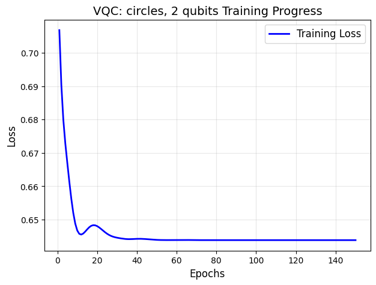</td>
<td width="50%" align="center"><b>VQC — Moons, 2 qubits</b><br>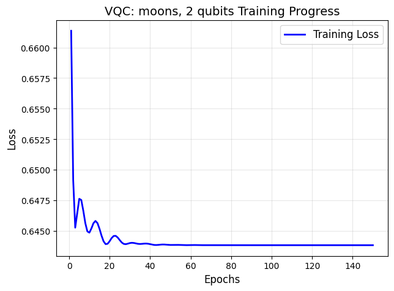</td>
</tr>
<tr>
<td width="50%" align="center"><b>VQC_hybrid — Circles, 2 qubits</b><br>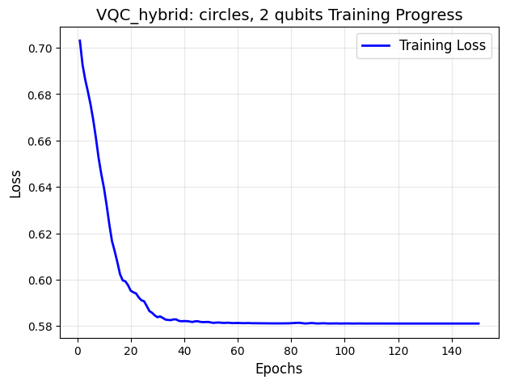</td>
<td width="50%" align="center"><b>VQC_hybrid — Moons, 2 qubits</b><br>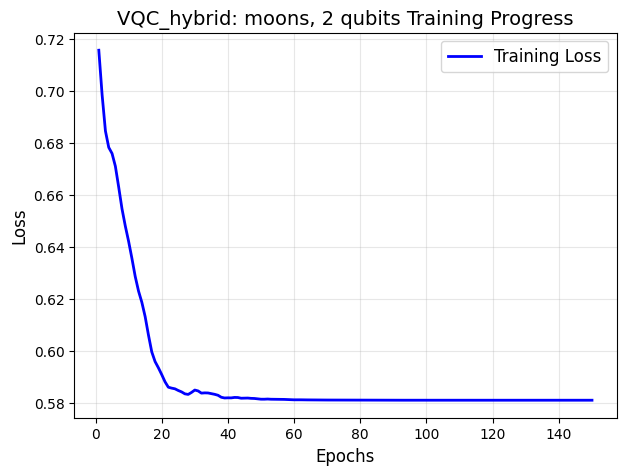</td>
</tr>
<tr>
<td width="50%" align="center"><b>MLP — Circles, [32, 32]</b><br></td>
<td width="50%" align="center"><b>MLP — Moons, [32, 32]</b><br>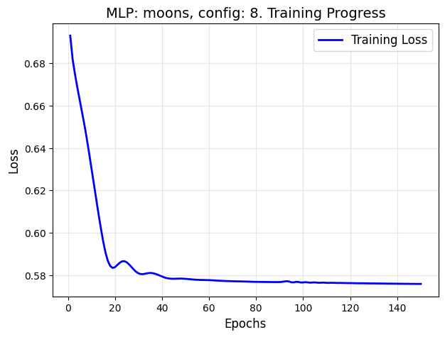</td>
</tr>
</table>

**Вывод:** у чистого `VQC` loss быстро стабилизируется на высоком уровне, что соответствует слабому градиентному сигналу. У `VQC_hybrid` и `MLP` итоговый loss ниже, но гибридная модель все равно может терять устойчивость при увеличении числа кубитов.

---

## Дополнительная диагностика VQC

После базового эксперимента был добавлен отдельный диагностический запуск `VQC` с логированием loss, gradient norm и gradient variance по эпохам. Это позволяет увидеть не только финальное значение градиента, но и всю динамику оптимизации.

| Dataset | n_qubits | Final Loss | Mean Last20 Grad Norm | Mean Last20 Grad Var | Accuracy | Precision | Recall | F1 |
|---|---:|---:|---:|---:|---:|---:|---:|---:|
| Circles | 2 | 0.633277 | 0.000079 | 5.79e-10 | 0.642000 | 0.619979 | 0.781818 | 0.691557 |
| Circles | 4 | 0.623844 | 0.000199 | 1.73e-09 | 0.633333 | 0.613169 | 0.774026 | 0.684271 |
| Circles | 8 | 0.669791 | 0.000372 | 3.12e-09 | 0.600667 | 0.595745 | 0.690909 | 0.639808 |
| Moons | 2 | 0.528026 | 0.000488 | 2.52e-08 | 0.818000 | 0.829139 | 0.812987 | 0.820984 |
| Moons | 4 | 0.574581 | 0.000084 | 3.67e-10 | 0.790000 | 0.806191 | 0.777922 | 0.791804 |
| Moons | 8 | 0.640869 | 0.000116 | 2.98e-10 | 0.717333 | 0.752187 | 0.670130 | 0.708791 |

### Диагностические графики

<table>
<tr>
<td width="50%" align="center"><b>Circles — 2 qubits</b><br>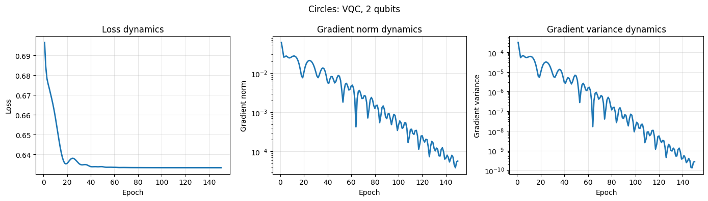</td>
<td width="50%" align="center"><b>Circles — 8 qubits</b><br>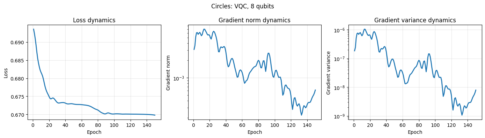</td>
</tr>
<tr>
<td width="50%" align="center"><b>Moons — 2 qubits</b><br>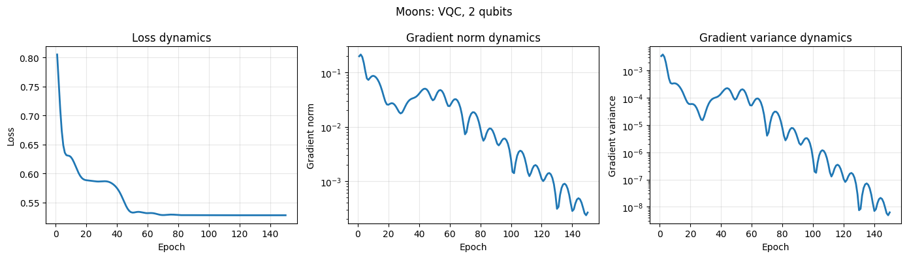</td>
<td width="50%" align="center"><b>Moons — 8 qubits</b><br>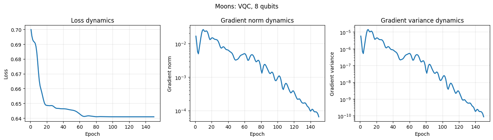</td>
</tr>
</table>

**Вывод:** наиболее сильная деградация наблюдается на `Moons`: F1-score падает с **0.820984** при 2 кубитах до **0.708791** при 8 кубитах. Это показывает, что увеличение числа кубитов не улучшает чистый VQC, а ухудшает обучаемость.

---

## Влияние числа кубитов на градиенты

Следующие графики показывают, как средняя норма градиента за последние эпохи меняется при увеличении числа кубитов.

<table>
<tr>
<td width="50%" align="center"><b>Circles</b><br>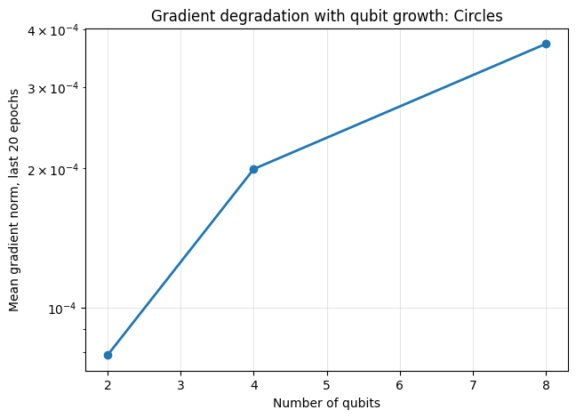</td>
<td width="50%" align="center"><b>Moons</b><br>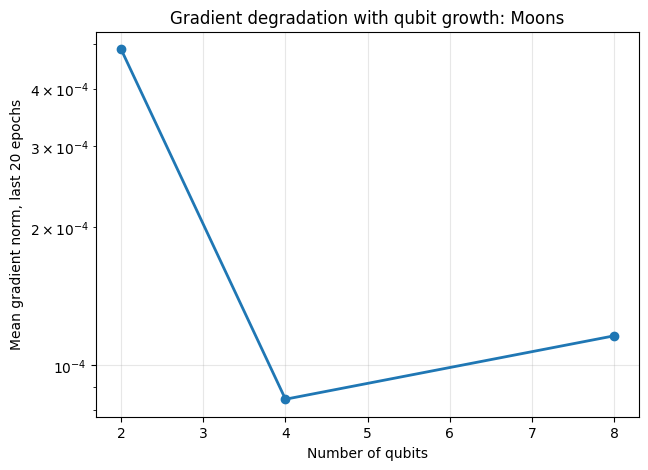</td>
</tr>
</table>

На `Moons` деградация качества при росте числа кубитов выражена особенно явно. Для `Circles` зависимость нормы градиента не является строго монотонной, но качество при 8 кубитах все равно ухудшается. Это важно: на практике barren plateau может проявляться не только как идеально монотонное падение нормы градиента, но и как потеря качества на фоне слабого и нестабильного обучающего сигнала.

---

## Сравнение разных Ansatz

Для проверки влияния архитектуры квантовой схемы были рассмотрены три варианта Ansatz.

| Ansatz | Описание | Ожидаемое поведение |
|---|---|---|
| `ry_cz` | Ручная схема с чередованием `RY` и `CZ` | Простая, менее выразительная, но более обучаемая |
| `basic` | `BasicEntanglerLayers` | Компромисс между простотой и выразительностью |
| `strong` | `StronglyEntanglingLayers` | Более выразительная, но более рискованная с точки зрения barren plateau |

Общая идея: слишком простая схема может не иметь достаточной выразительности, а слишком сложная схема может быстрее попадать в область исчезающих градиентов.

---

## Результаты сравнения Ansatz

| Dataset | Ansatz | n_qubits | Final Loss | Mean Last20 Grad Norm | Mean Last20 Grad Var | Accuracy | Precision | Recall | F1 |
|---|---|---:|---:|---:|---:|---:|---:|---:|---:|
| Circles | ry_cz | 2 | 0.635570 | 0.000034 | 4.09e-10 | 0.648667 | 0.626694 | 0.780519 | 0.695200 |
| Circles | basic | 2 | 0.674609 | 0.000023 | 1.61e-10 | 0.605333 | 0.576329 | 0.872727 | 0.694215 |
| Circles | strong | 2 | 0.633276 | 0.000007 | 4.60e-12 | 0.642000 | 0.619979 | 0.781818 | 0.691557 |
| Circles | ry_cz | 4 | 0.635571 | 0.000069 | 9.62e-10 | 0.648667 | 0.626694 | 0.780519 | 0.695200 |
| Circles | basic | 4 | 0.650151 | 0.000103 | 1.63e-09 | 0.619333 | 0.594672 | 0.811688 | 0.686436 |
| Circles | strong | 4 | 0.623977 | 0.000117 | 6.26e-10 | 0.634000 | 0.613333 | 0.776623 | 0.685387 |
| Circles | ry_cz | 8 | 0.635570 | 0.000102 | 1.10e-09 | 0.648667 | 0.626694 | 0.780519 | 0.695200 |
| Circles | basic | 8 | 0.648540 | 0.000084 | 4.90e-10 | 0.652667 | 0.644264 | 0.722078 | 0.680955 |
| Circles | strong | 8 | 0.664717 | 0.000093 | 1.96e-10 | 0.575333 | 0.607780 | 0.487013 | 0.540735 |
| Moons | ry_cz | 2 | 0.690785 | 0.000285 | 1.54e-08 | 0.548000 | 0.578231 | 0.441558 | 0.500736 |
| Moons | basic | 2 | 0.584387 | 0.000155 | 5.90e-09 | 0.688000 | 0.699208 | 0.688312 | 0.693717 |
| Moons | strong | 2 | 0.528026 | 0.000153 | 2.17e-09 | 0.818000 | 0.829139 | 0.812987 | 0.820984 |
| Moons | ry_cz | 4 | 0.690653 | 0.001130 | 1.80e-07 | 0.548667 | 0.582301 | 0.427273 | 0.492884 |
| Moons | basic | 4 | 0.594442 | 0.000121 | 1.93e-09 | 0.738667 | 0.755405 | 0.725974 | 0.740397 |
| Moons | strong | 4 | 0.574596 | 0.000316 | 4.14e-09 | 0.788667 | 0.801598 | 0.781818 | 0.791584 |
| Moons | ry_cz | 8 | 0.690762 | 0.000578 | 2.18e-08 | 0.550000 | 0.581756 | 0.438961 | 0.500370 |
| Moons | basic | 8 | 0.620602 | 0.000184 | 2.61e-09 | 0.761333 | 0.772487 | 0.758442 | 0.765400 |
| Moons | strong | 8 | 0.621124 | 0.000105 | 2.46e-10 | 0.730667 | 0.731061 | 0.751948 | 0.741357 |

### Графики сравнения Ansatz

<table>
<tr>
<td width="50%" align="center"><b>Circles</b><br>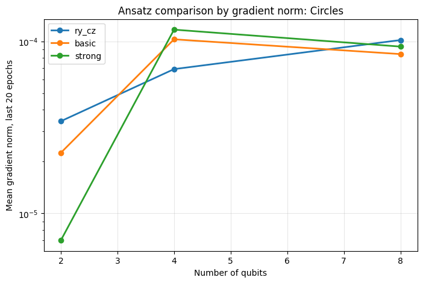</td>
<td width="50%" align="center"><b>Moons</b><br>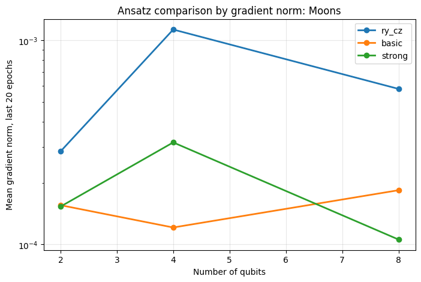</td>
</tr>
</table>

### Интерпретация Ansatz

**Circles.** Ручной Ansatz `RY + CZ` оказался наиболее стабильным: F1-score держится около **0.695** для 2, 4 и 8 кубитов. Это означает, что простая схема с ограниченной запутанностью может быть достаточно устойчивой на радиальной задаче.

**Moons.** При 2 кубитах лучший результат дает `StronglyEntanglingLayers`: F1-score = **0.820984**. Однако при росте числа кубитов качество этой схемы снижается до **0.741357** при 8 кубитах. Это показывает, что высокая выразительность полезна на малом числе кубитов, но может ухудшать устойчивость при масштабировании.

`BasicEntanglerLayers` на `Moons` показывает более стабильную динамику: F1-score растет с **0.693717** при 2 кубитах до **0.765400** при 8 кубитах. Этот Ansatz можно рассматривать как компромисс между выразительностью и обучаемостью.

---

## Динамическая пересборка Ansatz

Для обхода проблемы barren plateau была предложена стратегия **динамической пересборки квантовой схемы**. Вместо того чтобы фиксировать Ansatz заранее, обучение начинается с простой схемы, а затем архитектура изменяется в зависимости от поведения loss и градиентов.

Для принятия решения используются две величины:

$$
\Delta C = \bar{C}_{prev} - \bar{C}_{curr}
$$

где:

* $\Delta C$ — улучшение функции потерь;
* $\bar{C}_{prev}$ — среднее значение loss на предыдущем окне эпох;
* $\bar{C}_{curr}$ — среднее значение loss на текущем окне эпох.

И средняя норма градиента:

$$
\bar{G} = \frac{1}{K}\sum_{t=T-K+1}^{T}\|\nabla C_t(\theta)\|_2
$$

где:

* $\bar{G}$ — средняя норма градиента на последних эпохах;
* $K$ — размер окна усреднения;
* $T$ — последняя эпоха;
* $\nabla C_t(\theta)$ — градиент на эпохе $t$.

Правила пересборки:

| Условие | Интерпретация | Действие |
|---|---|---|
| $\Delta C$ мало, $\bar{G}$ достаточно велико | Нехватка выразительности | Усложнить Ansatz |
| $\Delta C$ мало, $\bar{G}$ близко к нулю | Barren plateau | Упростить Ansatz |
| $\Delta C$ заметно | Обучение продолжается | Оставить текущую схему |

---

## Результаты адаптивной пересборки

| Dataset | n_qubits | Final Ansatz | Final Layers | Final Loss | Mean Last20 Grad Norm | Mean Last20 Grad Var | Accuracy | Precision | Recall | F1 |
|---|---:|---|---:|---:|---:|---:|---:|---:|---:|---:|
| Circles | 2 | ry_cz | 1 | 0.675133 | 0.000305 | 5.80e-08 | 0.609333 | 0.579447 | 0.871429 | 0.696058 |
| Circles | 4 | strong | 1 | 0.646309 | 0.000050 | 2.17e-10 | 0.615333 | 0.592168 | 0.805195 | 0.682444 |
| Circles | 8 | strong | 2 | 0.676106 | 0.000375 | 7.07e-09 | 0.601333 | 0.594298 | 0.703896 | 0.644471 |
| Moons | 2 | strong | 2 | 0.516951 | 0.003255 | 2.00e-06 | 0.825333 | 0.835092 | 0.822078 | 0.828534 |
| Moons | 4 | strong | 2 | 0.590498 | 0.003747 | 1.52e-06 | 0.726667 | 0.741287 | 0.718182 | 0.729551 |
| Moons | 8 | strong | 2 | 0.666707 | 0.001675 | 1.24e-07 | 0.597333 | 0.620290 | 0.555844 | 0.586301 |

### Графики адаптивной пересборки

<table>
<tr>
<td width="50%" align="center"><b>Adaptive — Circles, 2 qubits</b><br>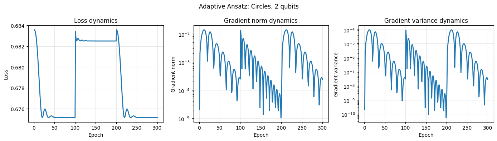</td>
<td width="50%" align="center"><b>Adaptive — Circles, 8 qubits</b><br>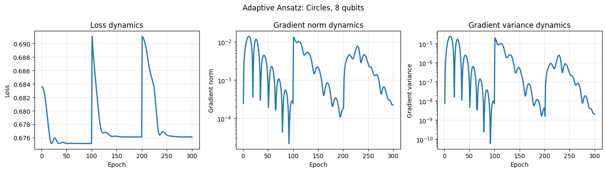</td>
</tr>
<tr>
<td width="50%" align="center"><b>Adaptive — Moons, 2 qubits</b><br>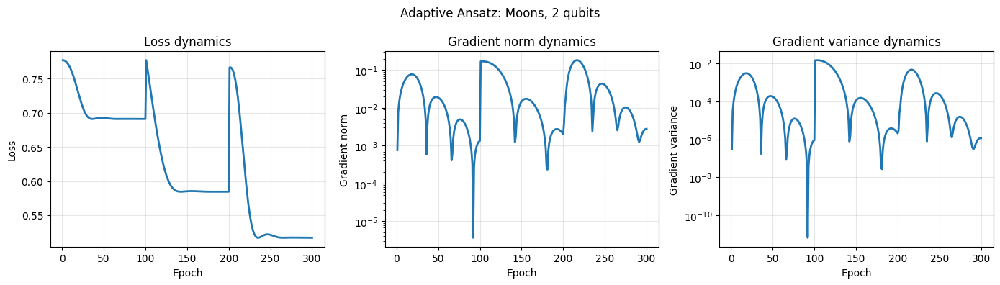</td>
<td width="50%" align="center"><b>Adaptive — Moons, 8 qubits</b><br>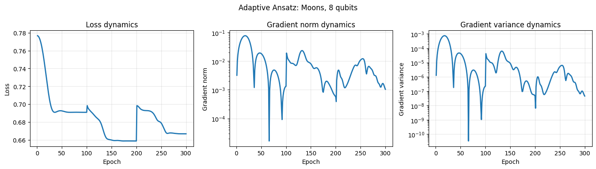</td>
</tr>
</table>

### Логи пересборки

| Experiment | Stage | Problem Type | Action | Ansatz | Layers |
|---|---:|---|---|---|---:|
| Circles_adaptive_2 | 0 | expressivity_limit | switch_to_basic | ry_cz | 1 |
| Circles_adaptive_2 | 1 | barren_plateau | simplify_to_ry_cz | basic | 1 |
| Circles_adaptive_2 | 2 | expressivity_limit | switch_to_basic | ry_cz | 1 |
| Circles_adaptive_4 | 0 | expressivity_limit | switch_to_basic | ry_cz | 1 |
| Circles_adaptive_4 | 1 | expressivity_limit | switch_to_strong | basic | 1 |
| Circles_adaptive_4 | 2 | barren_plateau | simplify_to_basic | strong | 1 |
| Circles_adaptive_8 | 0 | expressivity_limit | switch_to_basic | ry_cz | 1 |
| Circles_adaptive_8 | 1 | expressivity_limit | switch_to_strong | basic | 1 |
| Circles_adaptive_8 | 2 | expressivity_limit | increase_layers_to_2 | strong | 2 |
| Moons_adaptive_2 | 0 | expressivity_limit | switch_to_basic | ry_cz | 1 |
| Moons_adaptive_2 | 1 | expressivity_limit | switch_to_strong | basic | 1 |
| Moons_adaptive_2 | 2 | expressivity_limit | increase_layers_to_2 | strong | 2 |
| Moons_adaptive_4 | 0 | expressivity_limit | switch_to_basic | ry_cz | 1 |
| Moons_adaptive_4 | 1 | expressivity_limit | switch_to_strong | basic | 1 |
| Moons_adaptive_4 | 2 | expressivity_limit | increase_layers_to_2 | strong | 2 |
| Moons_adaptive_8 | 0 | expressivity_limit | switch_to_basic | ry_cz | 1 |
| Moons_adaptive_8 | 1 | expressivity_limit | switch_to_strong | basic | 1 |
| Moons_adaptive_8 | 2 | expressivity_limit | increase_layers_to_2 | strong | 2 |

**Вывод:** адаптивная стратегия не гарантирует максимальное качество во всех случаях, но дает важный исследовательский инструмент: она показывает, почему модель перестала улучшаться. В большинстве запусков была обнаружена нехватка выразительности (`expressivity_limit`), поэтому схема усложнялась. Для `Circles` при 2 и 4 кубитах были зафиксированы признаки `barren_plateau`, после чего схема упрощалась.

---

## Сравнение фиксированной и адаптивной стратегии

Адаптивная пересборка показывает лучший результат на `Moons` при 2 кубитах: F1-score = **0.828534**, что немного выше фиксированного `StronglyEntanglingLayers` при 2 кубитах. Однако при 4 и 8 кубитах качество адаптивной стратегии снижается.

На `Circles` адаптивная стратегия дает F1-score **0.696058** при 2 кубитах, **0.682444** при 4 кубитах и **0.644471** при 8 кубитах. Эти значения близки к лучшим фиксированным схемам, но не являются устойчивым улучшением.

Таким образом, адаптивная стратегия должна рассматриваться не как универсальный способ повысить accuracy, а как **механизм диагностики и управления сложностью квантовой схемы**.

---

## Итоговые выводы

1. **Barren plateau является измеримым эффектом.** У чистого `VQC` наблюдаются крайне малые нормы и дисперсии градиентов, а loss быстро выходит на плато.

2. **Рост числа кубитов не гарантирует улучшения.** На `Moons` чистый `VQC` ухудшается при переходе от 2 к 8 кубитам: F1-score падает с **0.820984** до **0.708791**.

3. **Гибридная архитектура помогает, но не решает проблему полностью.** `VQC_hybrid` создает более сильный градиентный сигнал, однако при 8 кубитах признаки затухания градиентов все равно появляются.

4. **Тип Ansatz критически важен.** `RY + CZ` стабилен на `Circles`, `StronglyEntanglingLayers` хорошо работает на `Moons` при малом числе кубитов, а `BasicEntanglerLayers` может быть компромиссом между устойчивостью и выразительностью.

5. **Деградация обучения может иметь разные причины.** Если loss не улучшается, но градиенты остаются ненулевыми, проблема может быть в нехватке выразительности. Если loss стоит и градиенты почти нулевые, это ближе к barren plateau.

6. **Адаптивная пересборка Ansatz полезна как диагностический механизм.** Она позволяет управлять сложностью схемы и фиксировать, когда модель нужно усложнять, а когда — наоборот упрощать.

7. **Основной результат исследования:** бороться с barren plateau нужно не простым увеличением числа кубитов, а контролируемым подбором архитектуры, глубины схемы, инициализации и стратегии оптимизации.

---

## Ограничения и дальнейшая работа

Несмотря на завершенность текущего этапа, исследование имеет несколько ограничений.

1. Эксперименты проводились на синтетических датасетах `Circles` и `Moons`. Они удобны для диагностики, но не отражают всей сложности реальных задач.

2. Адаптивная стратегия не переносит веса между разными Ansatz. При пересборке модель фактически начинает обучение новой схемы.

3. Пороги для определения `barren_plateau` и `expressivity_limit` выбраны вручную. В дальнейшем можно использовать статистический критерий или автоматический подбор порогов.

4. В работе использовалась глобальная функция стоимости. В дальнейшем можно сравнить ее с локальными функциями стоимости, которые могут быть менее подвержены barren plateau.

5. В дальнейшем стоит протестировать стратегию на более сложных данных и добавить перенос параметров между совместимыми слоями.

---

## Структура проекта

```text
project/
├── notebooks/
│   └── barren_plateau.ipynb
├── graphics/
│   ├── data_distribution.png
│   ├── training_vqc_circles_2q.png
│   ├── training_vqc_moons_2q.png
│   ├── diagnostics_vqc_circles_2q.png
│   ├── diagnostics_vqc_moons_8q.png
│   ├── gradient_scaling_circles.png
│   ├── gradient_scaling_moons.png
│   ├── ansatz_gradient_circles.png
│   ├── ansatz_gradient_moons.png
│   ├── adaptive_diagnostics_circles_2q.png
│   └── adaptive_diagnostics_moons_8q.png
└── README.md
```

---

## Как запустить

1. Установите зависимости:

```bash
pip install pennylane torch scikit-learn matplotlib seaborn pandas numpy
```

2. Откройте ноутбук:

```text
notebooks/barren_plateau.ipynb
```

3. Выполните все ячейки последовательно.

4. Для корректного отображения README сохраните графики в папке:

```text
graphics/
```

---

## Технологии

* [PennyLane](https://github.com/PennyLaneAI/pennylane) — квантовые модели и TorchLayer;
* PyTorch — классические нейросети, автодифференцирование и оптимизация;
* Scikit-learn — синтетические датасеты, метрики и preprocessing;
* Matplotlib / Seaborn — визуализация графиков;
* Pandas / NumPy — обработка результатов экспериментов.

---